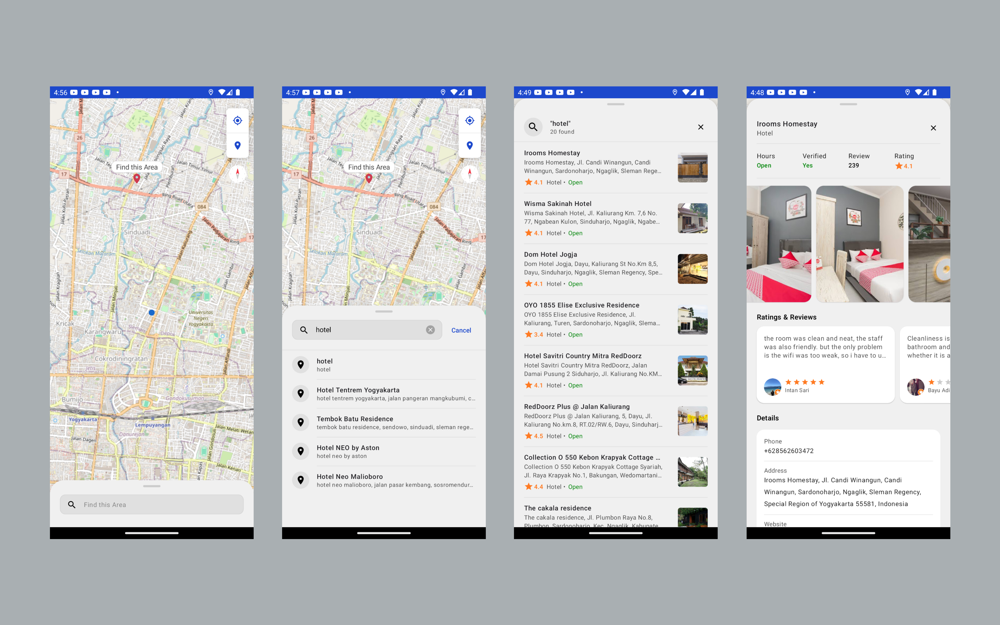

Android POI Maps
===================================

## Description

This repo contains small features that are useful for a wide
range of applications using the [OpenStreet Maps for Android](https://wiki.openstreetmap.org/wiki/Android). 

## Pre-requisites

* Android API level 24+
* See each sample for pre-requisites.
* All require up-to-date versions of the Android build tools and the Android support repository.
* The demo apps require that you add your own [Rapid API key](https://rapidapi.com/letscrape-6bRBa3QguO5/api/local-business-data).

## Demo App

This repository includes a [sample app](https://github.com/rikyahmadf/POI-Test/raw/main/app/release/app-release.apk) that illustrates the use of this library.

To run the demo app, you'll have to:

1. Sign in to subscription [Rapid API key](https://rapidapi.com/letscrape-6bRBa3QguO5/api/local-business-data)
1. Update a file `gradle.properties` in the root project (this file should *NOT* be under version control to protect API key and use `local.properties` is recommended).
1. Update a single line to `gradle.properties` that looks like `API_KEY=YOUR_API_KEY`, where `YOUR_API_KEY` is the API key you obtained in the first step
1. Build and run the `debug` variant for Android version